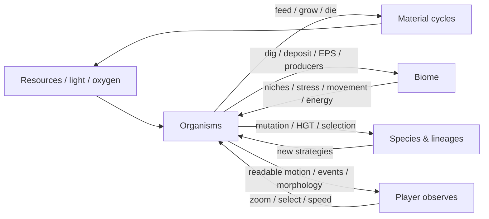

# MICROCORE — Living Microscope

**Date:** 2026-10-05  
**Audience:** whole team  
**Design question:** What must the player understand and enjoy when simply watching the dish?

> **Promise:** a microscopic world that keeps changing because organisms evolve, compete, engineer habitats and alter the future conditions of evolution.

## Non-negotiable

- No scripted fixed ecosystem outcome.
- Evolution has no designed terminal state.
- Extinction of active populations is allowed; dormant lineage banks prevent accidental permanent deletion of the evolutionary search space.
- Terraforming must change future organism fitness, not only visuals.
- Acceleration cannot replace organisms with unreadable cubes.
- Performance optimizations may approximate cadence/data layout, but must not delete core biology.

## Success looks like

A long run produces:
- several active guilds and multiple phenotype species;
- species composition changing through time;
- habitat-state transitions that correlate with organisms;
- predator populations tracking prey instead of sticking to safety ceilings;
- visible movement direction and morphological divergence;
- real x1/x2/x4/x8 progress reported honestly.

## Current evidence

The 11.5-hour legacy run exposed refuge churn and predator lock. Those mechanisms were replaced with ecological seed banks, species clustering, niche-driven wake-up and trophic carrying capacities. Current CI soak tracks the corrected world.
