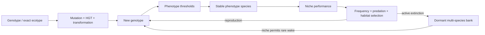

# Evolution & Species

**Date:** 2026-10-05  
**Audience:** biology / simulation / rendering  
**Design question:** How can evolution continue indefinitely without turning every mutation into an unreadable “new species”?

## Separation that matters

| Layer | Meaning | Expected scale |
| --- | --- | --- |
| ecotype | fine genetic identity | hundreds / thousands |
| phenotype species | stable ecological/morphological cluster | tens |
| guild | broad trophic role | handful |
| lineage | ancestry/history | unbounded |

**Rule:** anti-monoculture pressure operates on phenotype species, not exact ecotype hashes.

## No fake immortality

Dormant banks:
- keep several evolved species per guild;
- wake only after active extinction;
- do not increment reproductive generation;
- have long cooldowns;
- wake according to viable niches;
- never enforce an artificial live-population floor.

## Selection loops

- abundant prey raises predator carrying capacity;
- scarce prey raises predator competition cost;
- abundant bacterial species face frequency-dependent pressure;
- habitat traits bias local movement and energetic success;
- morphology/color are anchored to stable species with within-species lineage variation.

## Metrics

Track: species per guild, exact ecotypes, lineage bins, max true generation, mutation/HGT/transformation, reproduction per guild, predation edges, prey escape, refuge wakes.

**Current target:** many genotypes, fewer readable species, no predator pinned to a safety ceiling.
