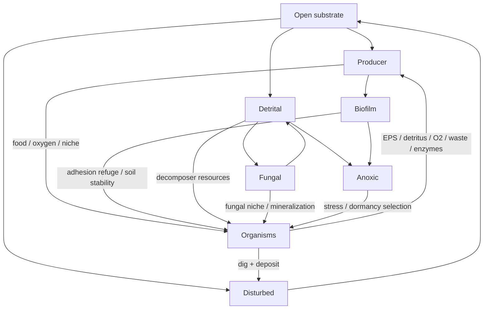

# Biome Succession & Terraforming

**Date:** 2026-10-05  
**Audience:** ecology / terrain / rendering  
**Design question:** How does the dish become a changing ecosystem rather than a static background?

## Persistent habitat states

Open · Producer · Biofilm · Detrital · Fungal · Anoxic · Disturbed.

Transitions require persistent field conditions (hysteresis); they are not frame-by-frame color labels. **Disturbed is explicitly temporary:** excavation/deposition creates a decaying local disturbance memory, so engineered terrain later matures into another ecological state instead of remaining permanently tagged as damaged.

## Bidirectional rules

Organisms → biome:
- excavation/deposition alter relief;
- producers alter oxygen/resource structure;
- EPS creates biofilm;
- death/predation create detritus and damage cues;
- fungi/decomposers alter detrital chemistry.

Biome → organisms:
- habitat affinity bends movement;
- anoxia costs energy according to tolerance;
- producer/biofilm/detrital niches reward matching traits;
- low detritus can push decomposers into spores and hyphal colonies into quiescence; renewed detritus wakes them locally without creating a new generation;
- habitat state alters substrate diggability;
- biome state alters slope stability.

## Readability

Each mature state gets a distinct but water-dominant material tint. Terrain change must be legible at overview without becoming a full-screen colored wash.

## Metrics

Area per biome state, transitions, excavation/deposition, field maxima, guild/species occupancy by habitat (next), survival/reproduction correlated with habitat.

**Current decision:** recent terraforming drives a temporary pioneer/disturbance state; old height changes remain physically present but no longer force the ecological label. Next evidence gate is the 10-minute soak: disturbed area should peak and recover while producer/biofilm/detrital/fungal/anoxic states can replace it.
