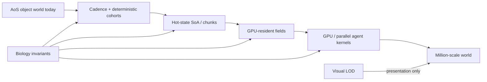

# Scale Without Deleting the Simulation

**Date:** 2026-10-05  
**Audience:** performance / simulation / rendering  
**Design question:** How do we move from hundreds toward millions while preserving biology and visual identity?

## Performance truth

At 60 biological ticks/s:
- x1 budget ≈ 16.67 ms/tick
- x2 ≈ 8.33 ms/tick
- x4 ≈ 4.17 ms/tick
- x8 ≈ **2.08 ms/tick**

Reported speed must use simulation-time / wall-time, never requested speed.

## Allowed approximation

- slower field cadence with numerically stable integration;
- deterministic cohort updates;
- spatial indexing / bounded neighborhoods;
- cached/cold genetic state;
- SoA/chunked hot state;
- GPU fields/compute;
- visual batching and continuous LOD.

## Forbidden shortcut

- removing mutation, predation, terraformation or guilds to hit FPS;
- freezing evolution at high population;
- unreadable one-pixel/cube replacement;
- pretending requested x8 equals achieved x8.

## Current tranche

- Dense bacterial terrain updates are deterministic cohorts: every organism keeps its terrain/biome behavior, but expensive physical evaluation is distributed in time with compensated `dt`.
- Phenotype-species identity is now cold cached state on bacteria and is invalidated only by phenotype/genome changes. Hot population/render loops no longer repeatedly classify unchanged cells.
- Water flow is materialized as a packed per-field Vector2 cache; bacterial movement consumes the already-known field index instead of repeating world→grid conversion in the hot loop.
- Far-LOD bacterial rendering now consumes a dense packed render snapshot (position/orientation/size/species/lineage/life-state) instead of walking RefCounted bacteria. Individual inspection remains stable-ID/object based until the next #20 tranche.
- Ordinary bacterial ticks no longer rebuild a second Array of every cell. Biology mutates cells in place; completed deaths/divisions trigger one stable compaction pass and a recycled birth buffer. This removes O(N) reference copying from no-identity-change ticks.
- Frequency-dependent lineage/species metadata uses adaptive cadence (1× small, 1/2 mass, 1/4 ultra). The hard population ceiling still uses exact packed population size, so this optimization adds only bounded ecological-pressure latency, not population-limit drift.
- Bacterial motility now uses a cached derived phenotype coefficient (gene speed + appendages + size + regulated matrix/photo/detritus drag), refreshed only when heredity/regulation changes. Motion-only cohorts avoid rebuilding the same static expression every step.
- The main bacterial loop routes cells directly to full-metabolism vs motion-only paths. Dense populations avoid a per-cell `_advance_cell → _should_run_metabolism → motion-only` dispatch chain on skipped metabolism cohorts.
- Motion-only curvature uses a deterministic sine LUT (phase step ≈0.031 rad) instead of evaluating `sin()` per bacterial cell. Visual wandering remains smooth/coherent while dense-agent trig cost is removed.
- A persistent `BacteriaHotStore` now mirrors dense-index hot state (stable ID, position, angle, energy, age, geometry, species/lineage hues and life flags). It is **lazy-synchronized for rendering** instead of mirrored on every biological sub-tick; identity changes only invalidate it. Mechanics keeps its dedicated packed position/radius/activity buffers, avoiding a second O(N) packed mirror tax. This preserves the SoA bridge without regressing the CPU core.
- Dense movement lookup uses reciprocal field-cell multiplication, a pre-scaled direction LUT, non-negative integer modulo, and avoids zero-value adhesion writes. These preserve the same mapping while removing generic math/function overhead from the dominant motion path.
- The ultra-density motion-only path is now inlined in the bacterial loop. Its dt-only phage/drift factors are computed once per agent tick and its EPS drag is collapsed to one motion scale, avoiding ~80% of per-cell GDScript motion dispatches at 10k.
- Motion-only boundary response now keeps position/angle local through integration and writes each back once, instead of writing object state and immediately re-reading it inside `_constrain_to_world()`.

This is the first explicit hot/cold split for #20; stable biological IDs remain unchanged.

## Next structural milestone

Packed SoA/chunks for bacterial hot state, then GPU-resident chemistry/biome fields. Benchmark after every tranche against 100/500/1k/2k/5k/10k.
