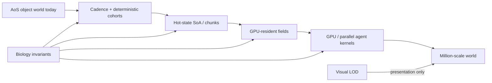

# Scale Without Deleting the Simulation

**Date:** 2026-10-05  
**Audience:** performance / simulation / rendering  
**Design question:** How do we move from hundreds toward millions while preserving biology and visual identity?

## Performance truth

At 60 biological ticks/s:
- x1 budget ≈ 16.67 ms/tick
- x2 ≈ 8.33 ms/tick
- x4 ≈ 4.17 ms/tick
- x8 ≈ **2.08 ms/tick**

Reported speed must use simulation-time / wall-time, never requested speed.

## Allowed approximation

- slower field cadence with numerically stable integration;
- deterministic cohort updates;
- spatial indexing / bounded neighborhoods;
- cached/cold genetic state;
- SoA/chunked hot state;
- GPU fields/compute;
- visual batching and continuous LOD.

## Forbidden shortcut

- removing mutation, predation, terraformation or guilds to hit FPS;
- freezing evolution at high population;
- unreadable one-pixel/cube replacement;
- pretending requested x8 equals achieved x8.

## Current tranche

- Dense bacterial terrain updates are deterministic cohorts: every organism keeps its terrain/biome behavior, but expensive physical evaluation is distributed in time with compensated `dt`.
- Phenotype-species identity is now cold cached state on bacteria and is invalidated only by phenotype/genome changes. Hot population/render loops no longer repeatedly classify unchanged cells.
- Water flow is materialized as a packed per-field Vector2 cache; bacterial movement consumes the already-known field index instead of repeating world→grid conversion in the hot loop.
- Far-LOD bacterial rendering now consumes a dense packed render snapshot (position/orientation/size/species/lineage/life-state) instead of walking RefCounted bacteria. Individual inspection remains stable-ID/object based until the next #20 tranche.
- Ordinary bacterial ticks no longer rebuild a second Array of every cell. Biology mutates cells in place; completed deaths/divisions trigger one stable compaction pass and a recycled birth buffer. This removes O(N) reference copying from no-identity-change ticks.

This is the first explicit hot/cold split for #20; stable biological IDs remain unchanged.

## Next structural milestone

Packed SoA/chunks for bacterial hot state, then GPU-resident chemistry/biome fields. Benchmark after every tranche against 100/500/1k/2k/5k/10k.
