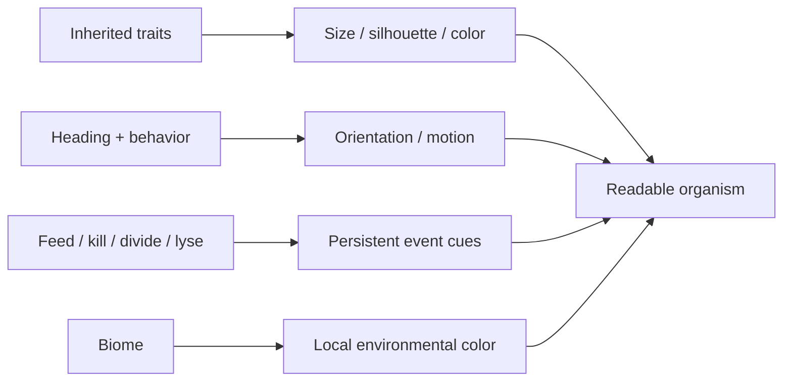

# Microscope Readability

**Date:** 2026-10-05  
**Audience:** rendering / UX / biology  
**Design question:** Can the player visually understand what organisms are, where they move, what they do and how they evolved at every speed/zoom?

## Identity hierarchy

**Guild silhouette → phenotype-species identity → lineage variation → individual state.**

Species color is stable enough to follow through time; lineage hue adds bounded variation. Size follows inherited morphology.

## Acceleration rule

x4/x8 may reduce rendering cost only when population/zoom actually requires it. At ordinary populations, acceleration no longer automatically sacrifices the pixel-art silhouettes. The fitted camera uses relative user zoom for LOD decisions so resolution/window size cannot accidentally force coarse glyphs.

x4/x8 may reduce rendering cost, but:
- keep directional silhouettes;
- keep species color/morphology;
- keep major biological events visible;
- only enter far LOD when population/zoom warrants it;
- never replace a small population with generic cubes solely because speed is x8.

## Movement rule

Front/back must be obvious from heading. Wandering can curve; prey pursuit, chemotaxis, flow and habitat preference must visibly bend trajectories for understandable reasons.

Bacterial movement now separates **decision cadence** from **motion cadence**: sparse regulation ticks sample local nutrient/exudate/detritus/EPS/damage gradients and cache an ecological steering intention; cheap intermediate motion follows that intention smoothly. This keeps dense movement purposeful instead of becoming straight-line drift when metabolism is staggered.

## Environment rule

Terraforming and mature biome states must read as spatial structures, not subtle numeric overlays.

Dormancy is also visible: bacterial dormancy already desaturates cells; decomposer spores now contract/darken and quiescent hyphae become thinner/duller while keeping their species tint underneath. The player can distinguish "temporarily inactive" from "dead/disappeared".

## Validation

Live review + screenshots/video at x1/x4/x8 and overview/medium/close zoom. Telemetry tells performance; visual review tells whether optimization destroyed meaning.
